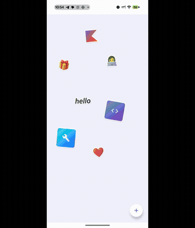
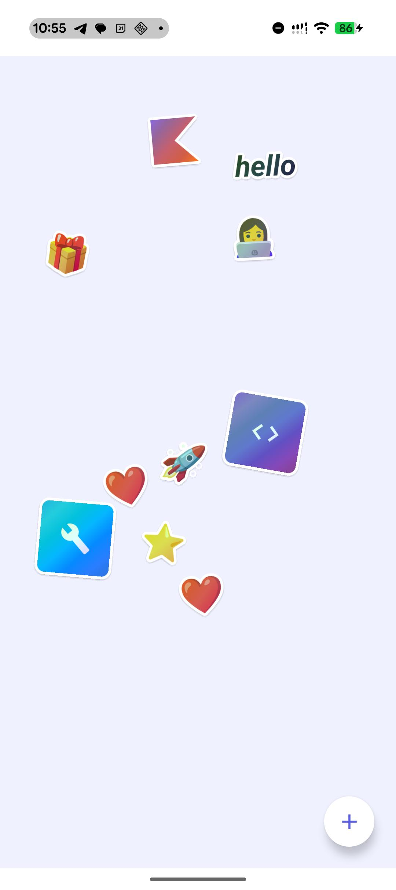
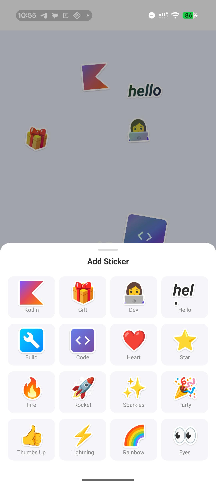
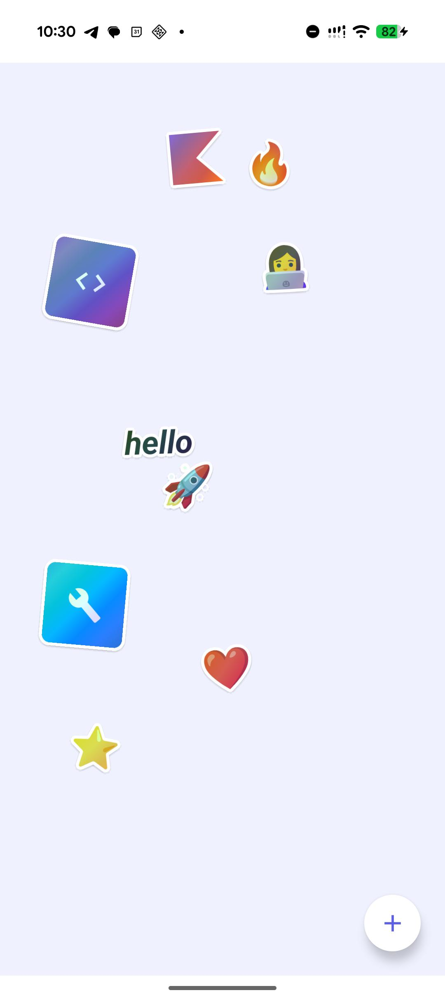

<h1 align="center">
  <br>
  StickerExplode
  <br>
</h1>

<h3 align="center">Slap stickers. Pinch, spin, fling. Vibe.</h3>

<p align="center">
  
  
  
  
</p>

<p align="center">
  
</p>

---

A Compose Multiplatform sticker canvas — place, drag, pinch-zoom, rotate, and peel stickers off a canvas like they're real. Holographic shimmer, haptic feedback, spring physics, and die-cut outlines that make every sticker feel *tactile*.

## Screenshots

<p align="center">
  
  &nbsp;
  
  &nbsp;
  
</p>

## What makes it pop

| | Feature | The details |
|---|---|---|
| **Peel-off grab** | Stickers lift + scale when you grab them, with a dynamic drop shadow that grows as they rise |
| **Holographic shimmer** | Tilt your phone — an iridescent shader responds to the accelerometer in real-time |
| **Die-cut outlines** | White border around every sticker, just like a real vinyl die-cut |
| **Spring physics** | Double-tap for a bouncy 2x zoom, everything animates with spring specs |
| **Haptic feedback** | Feel every grab, drop, tap, and selection through your fingertips |
| **Pinch + Rotate** | Full multi-touch transform gestures on every sticker |
| **Z-ordering** | Tap a sticker to pop it to the front |
| **History log** | Chronological record of everything you've placed, persisted across launches |
| **State persistence** | Full canvas state saved to DataStore — pick up right where you left off |

## The sticker lineup

```
  Kotlin logo    Gift    Dev       Hello     Build     Code
      Heart      Star    Fire      Rocket    Sparkles  Party
   Thumbs Up  Lightning  Rainbow   Eyes
```

16 stickers across emoji, custom canvas drawings, styled text, and Material icon styles.

## Under the hood

```
Kotlin Multiplatform
├── Compose Multiplatform ─── Declarative UI across Android & iOS
├── Material 3 ──────────── Bottom sheets, FAB, icons
├── Navigation Compose ───── Canvas + History screen nav
├── DataStore ────────────── Full canvas state persistence
├── Compose Gestures ─────── detectTransformGestures + detectTapGestures
├── Spring Animations ────── animateFloatAsState with spring specs
├── Platform Sensors ─────── Accelerometer/gyroscope via expect/actual
└── Platform Haptics ─────── Native haptic feedback via expect/actual
```

## Project layout

```
composeApp/src/
  commonMain/
    App.kt              # Root nav host
    StickerCanvas.kt    # The main canvas with draggable stickers
    StickerTray.kt      # Bottom sheet sticker picker
    ShimmerGlow.kt      # Tilt-based holographic shimmer modifier
    HistoryScreen.kt    # Chronological sticker history
    model/              # StickerData, HistoryEntry
    data/               # CanvasRepository, DataStore
    viewmodel/          # CanvasViewModel
    sensor/             # TiltSensor expect declarations
    haptics/            # HapticFeedback expect declarations
  androidMain/          # Android sensor + haptics implementations
  iosMain/              # iOS sensor + haptics implementations
iosApp/                 # SwiftUI entry point
```

## Get started

**Prerequisites:** Android Studio Ladybug+, Kotlin 2.1+, JDK 17+, Xcode 15+ (iOS)

```bash
# Android
./gradlew :composeApp:installDebug

# iOS
open iosApp/iosApp.xcodeproj
# then hit Run in Xcode
```

## License

MIT — go wild.
